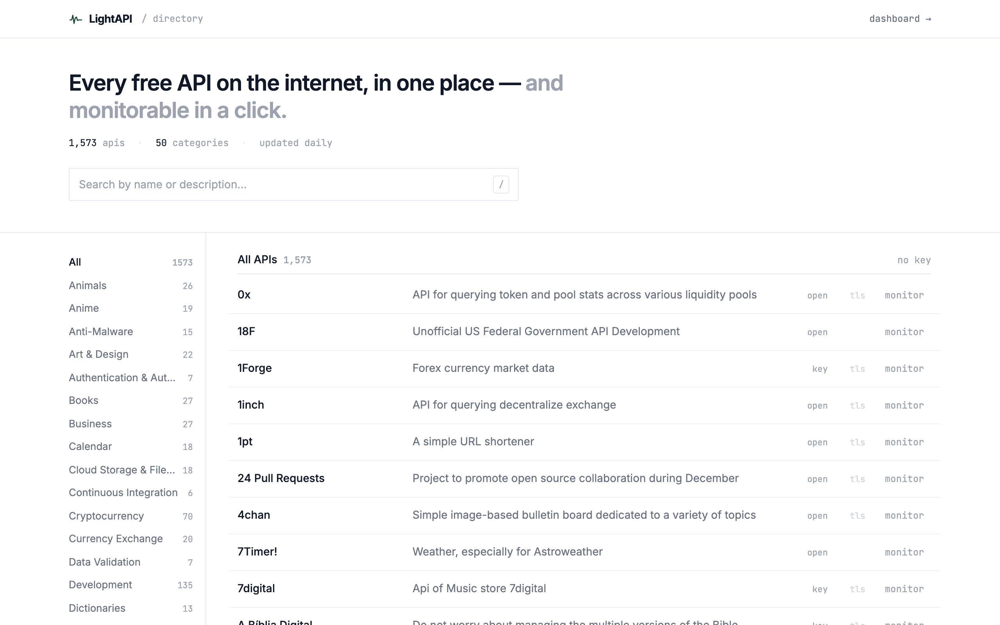
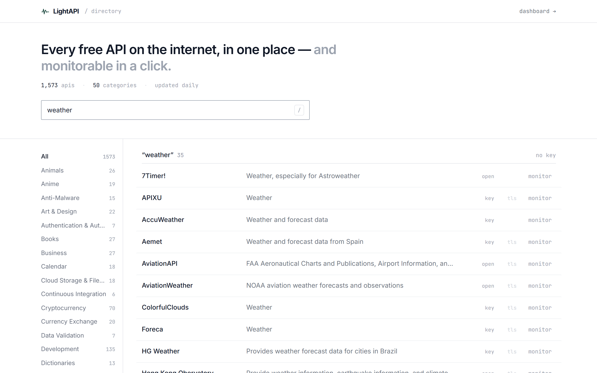
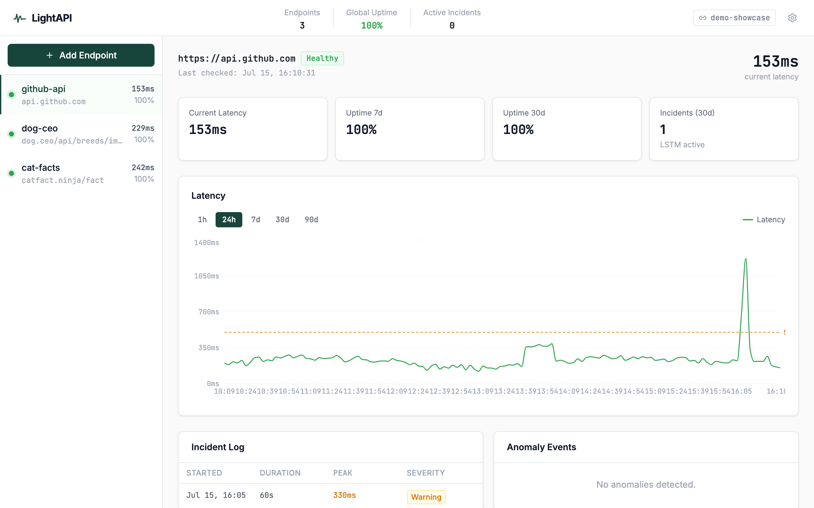

<div align="center">

# LightAPI

**Discover every free API on the internet — then monitor any of them, live, in one click.**

[](https://github.com/LightAnd2/LightAPI/actions/workflows/backend-tests.yml)
&nbsp;·&nbsp;
`React` `FastAPI` `PyTorch` `WebSocket` `SQLite`

</div>



Most API directories are static lists. LightAPI's are **monitorable**: search 1,500+ free public APIs by category, find one you like, click **Monitor**, and it drops into a real-time dashboard tracking its uptime and latency — with a per-endpoint LSTM that learns each service's normal and flags anomalies before they become outages.

> **Live:** [lightai-kohl.vercel.app](https://lightai-kohl.vercel.app) — directory and live monitoring, fully deployed (frontend on Vercel, backend on Render's free tier — the first request after a quiet spell takes ~50 s while the backend wakes).

---

## Highlights

**Discovery**
- Full-text search across **1,573 free APIs** in **50 categories**, sourced from the community [public-apis](https://github.com/public-apis/public-apis) project
- Filter by category, auth requirement, and HTTPS; refreshed automatically every day
- Fast, keyboard-first UI (`/` to search)

**Monitoring** — one click from any API
- Pings each endpoint on an interval; records latency, status, and uptime
- Live dashboard updates over **WebSocket** within 100 ms of each reading
- **Per-endpoint LSTM** trained on that service's own history; z-score fallback until it has enough data
- Predictive alerts, incident logs, root-cause correlation, and deploy-regression tracking

**Platform**
- **Multi-tenant** — every visitor gets an isolated workspace via an unguessable shareable link, no login
- Hardened: SSRF protection, per-IP rate limiting, resource caps, locked CORS, security headers
- Python **SDK** (`@monitor` decorator) for function-level tracing
- Fully tested (50 tests) with CI, and containerized for any host

---

## Discovery

<p align="center"></p>

Search is instant and debounced. The category rail shows live counts, and the `no key` filter narrows to APIs that need no authentication — the ones you can try immediately.

## Monitoring

<p align="center"></p>

Clicking **Monitor** on any API adds it to your workspace and opens this dashboard: live latency chart, uptime over 7/30 days, an alert threshold, incident log, and anomaly events. After 100 readings, a dedicated LSTM takes over from the z-score baseline (shown as *LSTM active*).

---

## How It Works

**Discovery** — A daily [APScheduler](https://apscheduler.readthedocs.io/) job fetches the latest public-apis dataset, parses it, and caches it in SQLite. A bundled snapshot seeds the directory instantly on first boot, so the app works with no network.

**Workspaces** — Every visitor gets a workspace on first visit, no signup. Its id lives in the browser and in a shareable link (`/dashboard?ws=<id>`); all endpoints, readings, and incidents are scoped to it. The id is 96 bits of cryptographic randomness — a capability URL, so treat it like a password.

**Monitoring loop** — An async job per endpoint records latency, status, and success into SQLite, indexed on `(endpoint_id, timestamp)` for fast range queries.

**Anomaly detection** — Two modes by data volume:

| Mode | Condition | Method |
|---|---|---|
| Z-score | < 100 readings | Flags readings > 2.5σ from the rolling mean |
| LSTM | 100+ readings | A 2-layer LSTM predicts the next value; flags actual > predicted × 1.5 |

The LSTM understands sequences — a spike at 3 a.m. is more anomalous than the same spike at noon, because the model has learned the endpoint's time-of-day pattern.

**Real-time fanout** — New readings broadcast over WebSocket only to clients subscribed to that endpoint's workspace, so live data never crosses workspace boundaries.

---

## Quick Start

**Backend**
```bash
cd backend
pip install -r requirements.txt
uvicorn app.main:app --reload --port 8000
```
On first run the API directory seeds from the bundled snapshot and three demo endpoints begin monitoring.

**Frontend**
```bash
cd frontend
npm install
npm run dev        # http://localhost:3000
```

**SDK** — instrument any Python function:
```python
pip install lightai
```
```python
from lightai import monitor

@monitor(name="get_users", threshold_ms=200)
def get_users(org_id): ...
```

---

## Security

LightAPI is a public, no-login app, so it is hardened against abuse and cross-tenant leakage:

- **SSRF** — monitored URLs are validated; private, loopback, and link-local addresses (including the cloud-metadata IP) and non-HTTP(S) schemes are rejected
- **Workspace isolation** — endpoints, readings, drift, RCA, the WebSocket feed, and GitHub webhooks are all scoped by workspace; verified by tests
- **Capability URLs** — workspace ids are 96-bit unguessable; the public `demo` workspace is read-only so it can't be vandalized
- **Rate limiting** (per IP) and **resource caps** (max endpoints per workspace) prevent the monitor from being turned into a traffic amplifier
- **Input bounds** on every field, **locked CORS**, and security headers (`nosniff`, `X-Frame-Options`, `Referrer-Policy`)

Set `LIGHTAI_API_KEY` in production to require an `X-API-Key` header on the SDK ingest endpoint.

---

## Tests & CI

```bash
cd backend
pip install -r requirements-dev.txt
pytest
```
50 tests cover the directory, workspace isolation, security, and abuse hardening, running against an isolated in-memory database with no network calls. They run automatically on every push via GitHub Actions.

---

## API Reference

Directory routes are public; endpoint routes are scoped by `?workspace=<id>` (default `demo`).

| Method | Path | Description |
|---|---|---|
| `GET` | `/api/directory` | Search the directory (`?search=`, `?category=`, `?auth=none\|key`, `?https_only=`) |
| `GET` | `/api/directory/categories` | Categories with counts + total |
| `POST` | `/api/workspaces` | Mint a new workspace id |
| `GET` | `/api/endpoints` | List endpoints (`?workspace=`) |
| `POST` | `/api/endpoints` | Add an endpoint (`?workspace=`, URL validated against SSRF) |
| `GET` | `/api/endpoints/:id` | Endpoint detail |
| `DELETE` | `/api/endpoints/:id` | Remove an endpoint |
| `GET` | `/api/endpoints/:id/readings` | Latency readings (`?range=1h\|24h\|7d\|30d\|90d`) |
| `GET` | `/api/endpoints/:id/incidents` | Incident log |
| `GET` | `/api/endpoints/:id/anomalies` | Anomaly events |
| `GET` | `/api/endpoints/:id/stats` | Uptime, latency, model status |
| `GET` | `/api/endpoints/:id/predictions` | LSTM forecast |
| `GET` | `/api/stats` | Workspace stats (`?workspace=`) |
| `POST` | `/api/ingest` | SDK readings ingest (optional `X-API-Key`) |
| `POST` | `/api/webhooks/github` | GitHub deploy webhook (`?workspace=`) |
| `WS` | `/ws` | Workspace live feed (`?workspace=`) |

---

## Deployment

The production instance runs on Render's free tier via the [`render.yaml`](render.yaml) blueprint at the repo root — connect the repo in the Render dashboard and it builds `backend/Dockerfile` with health checks and CORS preconfigured. See [docs/DEPLOY.md](docs/DEPLOY.md) for the full walkthrough.

The backend is a standard container, so it also runs on any host that takes a Dockerfile — Fly.io, Koyeb, or a VPS:

```bash
cd backend
docker build -t lightapi .
docker run -p 8000:8000 -v lightapi-data:/data \
  -e DATABASE_URL=sqlite:////data/lightapi.db \
  -e ALLOWED_ORIGINS=https://your-frontend.example.com \
  lightapi
```

| Variable | Purpose | Default |
|---|---|---|
| `PORT` | Server port | `8000` |
| `DATABASE_URL` | SQLite location (use a mounted volume) | `sqlite:///./lightai.db` |
| `ALLOWED_ORIGINS` | Comma-separated CORS allowlist | deployed site + localhost |
| `LIGHTAI_API_KEY` | If set, `/api/ingest` requires `X-API-Key` | _(unset → open)_ |
| `GITHUB_WEBHOOK_SECRET` | If set, webhook signatures are verified | _(unset → skipped)_ |

The frontend deploys to any static host (Vercel/Netlify); set `VITE_API_URL` and `VITE_WS_URL` to the backend's URL.

---

## Tech Stack

`React` · `Vite` · `Tailwind` · `Recharts` — frontend
`FastAPI` · `SQLAlchemy` · `SQLite` · `APScheduler` · `WebSocket` — backend
`PyTorch` (LSTM) · `scikit-learn` · `NumPy` — ML

## Project Structure

```
lightapi/
├── frontend/              React + Vite + Tailwind (Explore + Dashboard)
├── backend/
│   ├── app/               FastAPI routes, directory, monitor loop, WebSocket, RCA, drift, security
│   ├── ml/                LSTM model, trainer, predictor
│   ├── db/                SQLAlchemy models + query helpers
│   ├── data/              Bundled API directory snapshot
│   ├── tests/             pytest suite (run in CI)
│   └── Dockerfile
├── lightai-sdk/           pip-installable @monitor decorator
├── render.yaml            Render blueprint (production backend)
└── .github/workflows/     GitHub Actions CI
```

---

Built by [Andrew Koja](https://www.linkedin.com/in/andrewkoja) · [GitHub](https://github.com/LightAnd2) · [MIT License](LICENSE)
