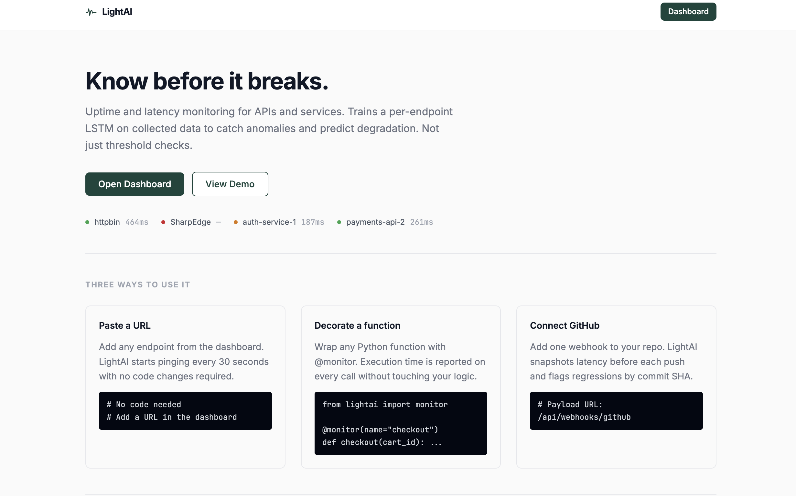
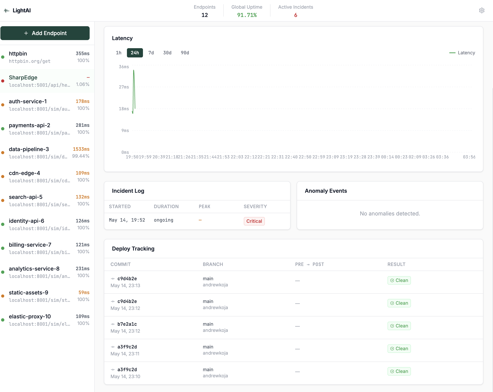

# LightAI

> Uptime and latency monitoring for APIs and services. Trains a per-endpoint LSTM on collected data to detect anomalies and predict degradation — not just threshold checks.

**Live:** [lightai-kohl.vercel.app](https://lightai-kohl.vercel.app) · **API:** [lightai-production.up.railway.app](https://lightai-production.up.railway.app)

**Stack:** `React` `FastAPI` `SQLite` `PyTorch` `APScheduler` `WebSocket`



---

## Quick Start

### 1. Backend

```bash
cd backend
pip install -r requirements.txt
uvicorn app.main:app --reload --port 8000
```

> On first run, three demo endpoints are seeded automatically so the dashboard is not empty.

### 2. Frontend

```bash
cd frontend
npm install
npm run dev
```

Open `http://localhost:3000`

### 3. Load Simulator (optional)

Spins up 10 synthetic services with realistic latency profiles. Useful for testing anomaly detection and populating the dashboard fast.

```bash
cd backend
uvicorn simulator.server:app --port 8001
```

The simulator auto-registers all 10 services with LightAI on startup.

---

## Adding an Endpoint

1. Open the dashboard and click **Add Endpoint**
2. Enter any URL — your own API, a third-party service, or `localhost`
3. Set a check interval (default 30s) and alert threshold (default 500ms)
4. Optionally add a webhook URL for Slack, Discord, or PagerDuty alerts
5. Click **Start Monitoring**

LightAI starts pinging immediately. After 100 readings (~50 minutes at 30s intervals), the LSTM trains automatically. Until then, z-score anomaly detection runs as a fallback.



---

## SDK — Function-Level Tracing

Instrument any Python function and report execution time directly to LightAI without modifying your logic.

**Install**

```bash
pip install lightai
```

**Usage**

```python
from lightai import monitor

@monitor(name="get_users", threshold_ms=200)
def get_users(org_id: str):
    return db.query(User).filter_by(org_id=org_id).all()

# Works with async functions too
@monitor(name="fetch_prices")
async def fetch_prices(card_id: str):
    return await client.get(f"/prices/{card_id}")
```

**Configure the backend URL** (defaults to `localhost:8000`)

```python
from lightai import configure
configure(url="https://your-backend.railway.app")
```

Or via environment variable:

```bash
export LIGHTAI_URL=https://your-backend.railway.app
```

The decorator is fire-and-forget. It never blocks or crashes the wrapped function — if LightAI is unreachable, it silently skips the report.

---

## GitHub Deploy Tracking

LightAI watches your endpoints after every push and flags latency regressions tied to specific commits.

**Setup**

1. Go to your repo → **Settings** → **Webhooks** → **Add webhook**
2. Set Payload URL to `https://your-backend.railway.app/api/webhooks/github`
3. Content type: `application/json`
4. Trigger: **Just the push event**
5. Save

After each push, LightAI will:

- Snapshot the pre-deploy latency baseline
- Monitor the endpoint for 10 minutes post-deploy
- Compare pre vs. post baselines
- Surface a regression badge in the Deploy Tracking panel if latency increased by 20% or more, linked to the commit SHA


---

## Alerts

Add a webhook URL when creating an endpoint to receive `POST` requests when:

- An endpoint goes down
- An anomaly is detected (includes confidence score)
- Predicted degradation is forecasted by the LSTM

Compatible with Slack incoming webhooks, Discord, PagerDuty, or any custom endpoint.

**Example payload**

```json
{
  "type": "anomaly_detected",
  "endpoint": "payments-api",
  "url": "https://api.example.com/payments",
  "actual_latency_ms": 843.2,
  "predicted_latency_ms": 201.4,
  "confidence": 0.87,
  "message": "Anomaly detected on payments-api: 843ms latency (confidence 87%)"
}
```

---

## Deployment

### Backend — Railway

1. Push this repo to GitHub
2. Create a new Railway project and connect the repo
3. Railway reads `railway.toml` automatically — no additional config needed
4. Generate a public domain in Railway → Settings → Networking
5. Set `GITHUB_WEBHOOK_SECRET` if using GitHub deploy tracking

### Frontend — Vercel

1. Install the Vercel CLI: `npm i -g vercel`
2. Run `vercel --cwd frontend --prod` and follow the prompts
3. Add environment variables via CLI:

```bash
vercel env add VITE_API_URL production
vercel env add VITE_WS_URL production
```

| Variable | Value |
|---|---|
| `VITE_API_URL` | Your Railway backend URL (e.g. `https://lightai-production.up.railway.app`) |
| `VITE_WS_URL` | Same URL with `wss://` scheme (e.g. `wss://lightai-production.up.railway.app`) |

4. Redeploy: `vercel --cwd frontend --prod`

---

## How It Works

**Monitoring loop**
APScheduler runs an async job per endpoint on the configured interval. Each ping records latency, status code, and success into SQLite, indexed on `(endpoint_id, timestamp)` for fast range queries.

**Anomaly detection**
Two modes depending on data volume:

| Mode | Condition | Method |
|---|---|---|
| Z-score | < 100 readings | Flags readings more than 2.5 standard deviations from the rolling mean |
| LSTM | 100+ readings | 2-layer LSTM predicts next latency value. Flags anomaly if actual > predicted × 1.5 |

Z-score only compares the current value against a static mean. The LSTM understands sequences — a spike at 3am is more anomalous than the same spike at noon because the model has learned the endpoint's time-of-day patterns.

**Root cause analysis**
When an endpoint goes down, LightAI cross-references all other monitored endpoints within a ±120 second window and classifies the failure as one of: `isolated`, `upstream_dependency`, `shared_infrastructure`, or `cascading_failure` — each with a confidence score.

**Baseline drift**
Compares the 24h average latency against the 30d average. If a service has silently gotten 30%+ slower without triggering any alerts, it surfaces as a drift warning in the dashboard.

**WebSocket fanout**
Each endpoint has its own subscription list. New readings are broadcast only to clients viewing that endpoint. A global channel handles sidebar updates across all endpoints simultaneously.

---

## Project Structure

```
lightai/
├── frontend/              React + Vite + Tailwind
├── backend/
│   ├── app/               FastAPI routes, monitor loop, WebSocket, RCA, drift, alerts
│   ├── ml/                LSTM model, trainer, predictor, daily retraining
│   ├── db/                SQLAlchemy models and query helpers
│   └── simulator/         Synthetic load generator (10 procedural services)
├── lightai-sdk/           pip-installable @monitor decorator
├── vercel.json
└── railway.toml
```

---

## API Reference

| Method | Path | Description |
|---|---|---|
| `GET` | `/api/endpoints` | List all endpoints |
| `POST` | `/api/endpoints` | Add an endpoint |
| `DELETE` | `/api/endpoints/:id` | Remove an endpoint |
| `GET` | `/api/endpoints/:id/readings` | Latency readings (`?range=1h\|24h\|7d\|30d\|90d`) |
| `GET` | `/api/endpoints/:id/incidents` | Incident log |
| `GET` | `/api/endpoints/:id/anomalies` | Anomaly events |
| `GET` | `/api/endpoints/:id/stats` | Uptime, latency stats, model status |
| `GET` | `/api/endpoints/:id/drift` | Baseline drift analysis |
| `GET` | `/api/endpoints/:id/deploys` | Deploy history |
| `GET` | `/api/endpoints/:id/predictions` | LSTM forecast (next N values) |
| `POST` | `/api/ingest` | SDK readings ingest |
| `POST` | `/api/webhooks/github` | GitHub push event receiver |
| `WS` | `/ws/:id` | Per-endpoint real-time feed |
| `WS` | `/ws` | Global feed (all endpoints) |

---

## Credits

Built by [Andrew Koja](https://www.linkedin.com/in/andrewkoja) — [GitHub](https://github.com/LightAnd2)
